原文：https://wenku.baidu.com/view/9aacf48ea21614791611282a.html

## 图像处理部分

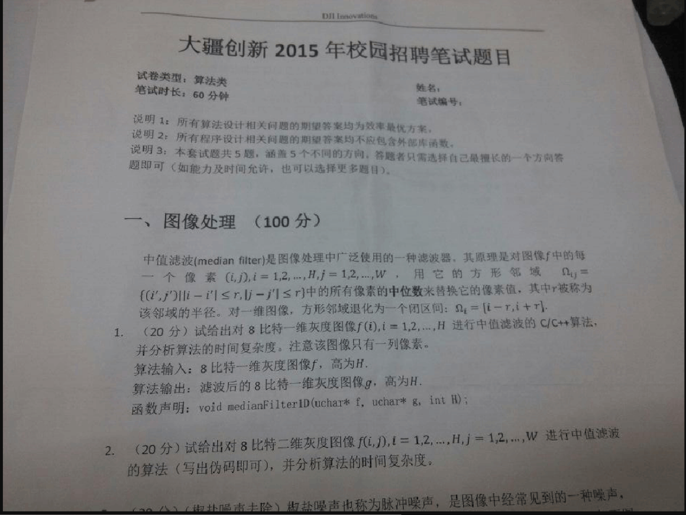


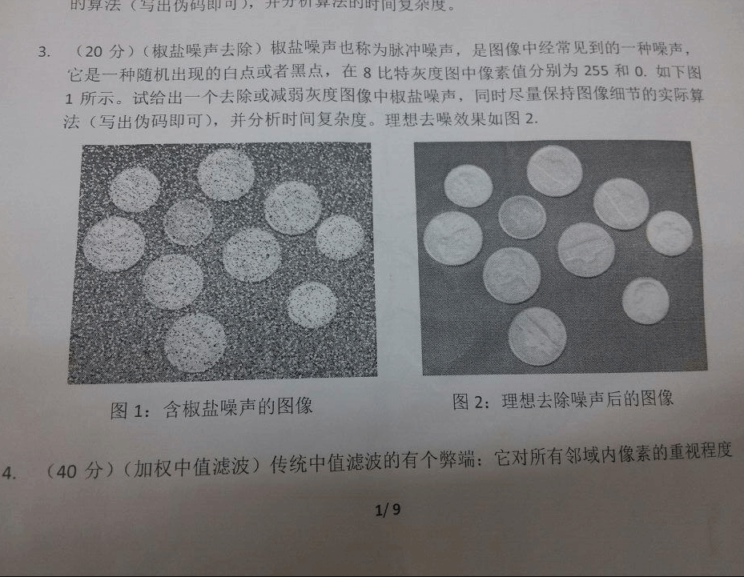


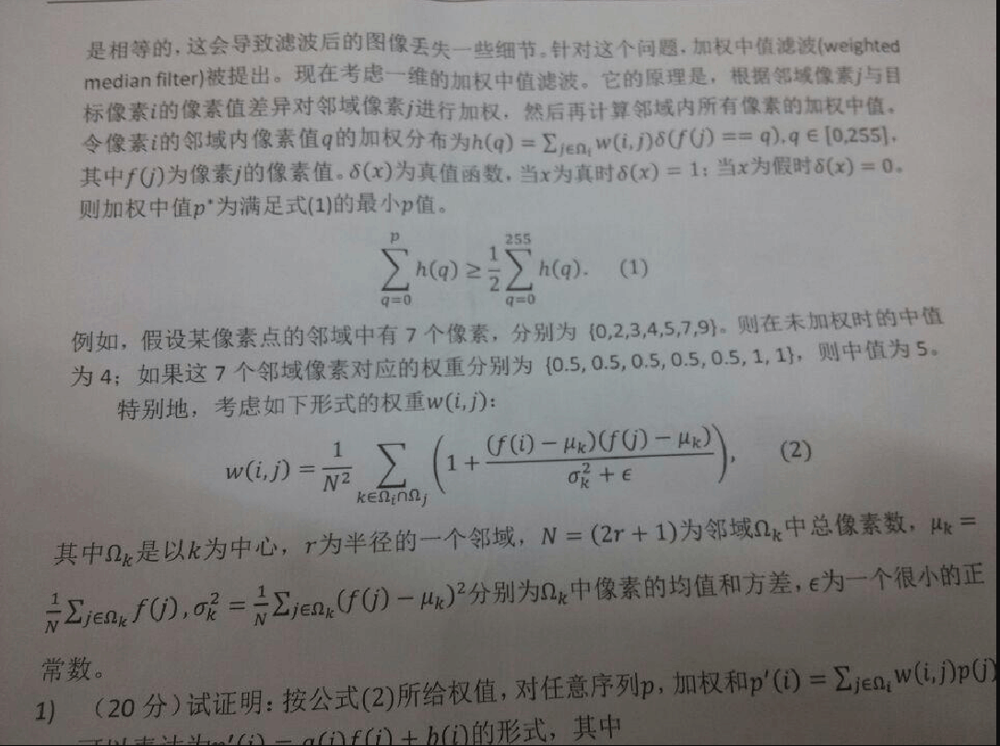


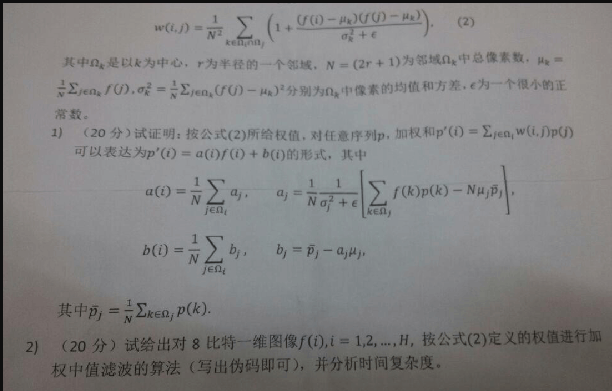


## 计算机视觉

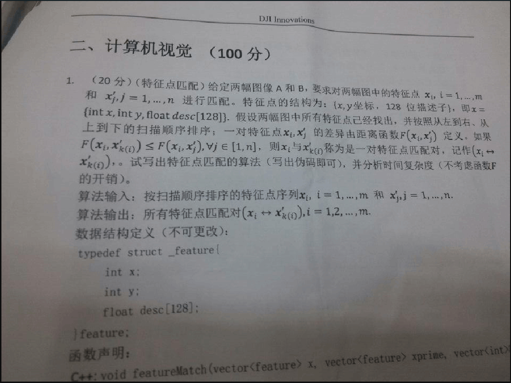

### 1 答案

方法一：暴力匹配。

```cpp
vector<bool> visited(n, false); 
vector<int> matchs(m, -1); // matchs[i] = j 表示xi的配对点为x'j，如果matchs[i] == -1则表示没有匹配点
for(所有的xi) i = 1,2,...,m{
    double min_F = 无穷大。
    int min_index = 0;
    
	for(所有的x'j) j=1,2,...,n{
		if(visited(x'j))
            continue;
        if(F(xi,x'j) < min_F){
			min_F = F(xi,x'j);
            min_index = j;
        }
    }
    matchs[i] = min_index;
}
```

方法二：KD树

[k-d tree算法](https://www.cnblogs.com/eyeszjwang/articles/2429382.html) | KD树讲得很好，看完基本对算法框架有个大致了解了。

《图像局部不变性特征与描述-王永明》P150 | 原始的kd树在回溯时很耗时，书中提到了kd树的一种简单改进，利用优先队列做BBF最近邻查询。


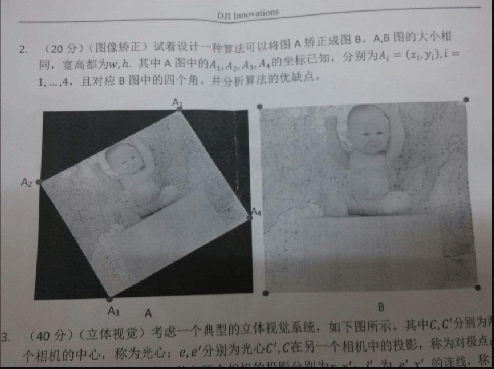

### 2 答案

《计算机视觉中的多视图几何》P53

https://www.cnblogs.com/wangguchangqing/p/8287585.html

若图像A和图像B之间是平移、旋转和缩放的关系，则可求解他们之间的相似矩阵进行校正。

不过这里不确定是什么关系，保险起见可求解两幅图像之间的单应变换H，正好所需4对匹配点求解。
$$
x = Hx'
$$

### TODO:归一化：为了得到更高的精度，在求解H前，先对坐标进行归一化处理：

每对匹配点提供2个独立方程，4对点提供8个独立方程，而H有9个未知数，可以求解出H的唯一解（差一个尺度因子）。


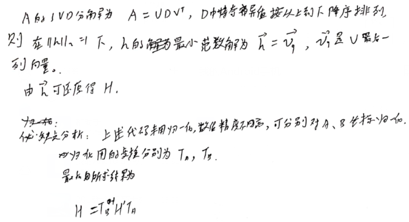


求解出H后，通过反向映射并双线性插值可得到图片B，具体做法是：

1. 生成一张与A同size空白图片B 
2. 遍历B中每个像素点，进行如下操作
   1. 通过H计算得到这个像素点在A中的坐标
   2. 在A 中的坐标是浮点数，取周围4个相邻像素点做双线性插值（如果是图片边界点，则边界外进行0填充）
   3. 讲插值得到的像素值作为图片B在该点的像素值
   4. 重复步骤1-3，直到遍历完整张图片B


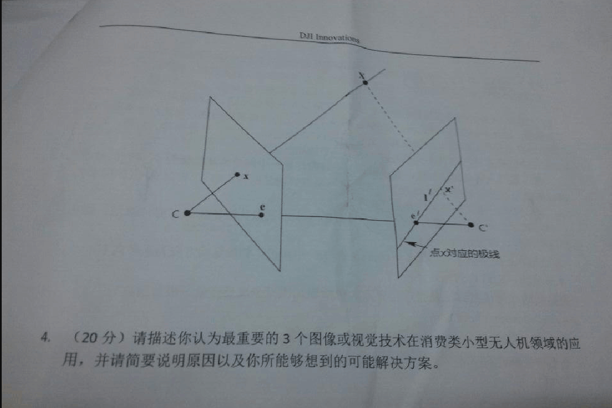


### 3.1答案：

参考：《SLAM十四讲》

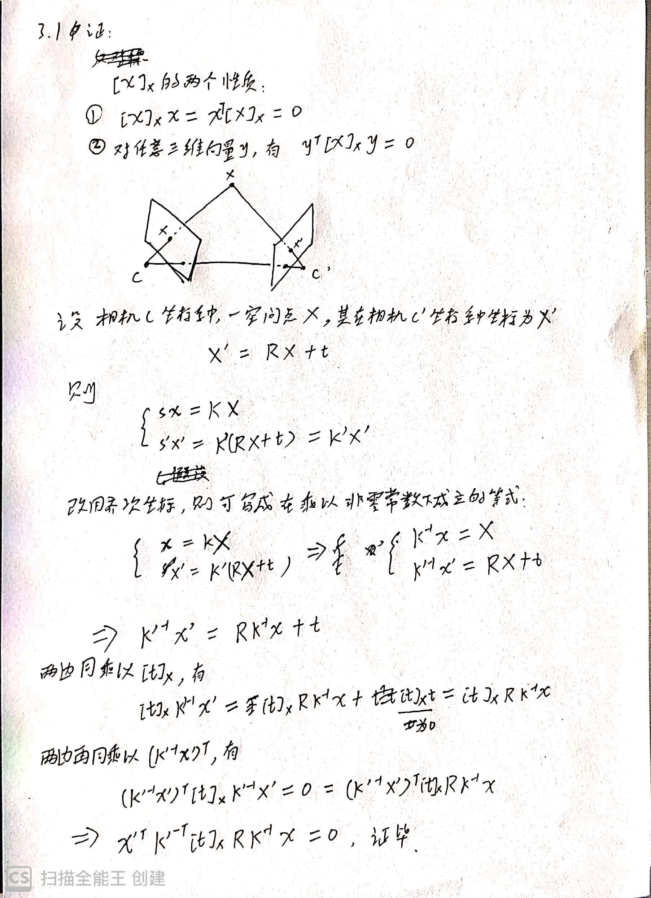


**F的秩是多少？**

参考：https://blog.csdn.net/u012633319/article/details/80727056

$F = K'^{-T}[t]_{times}RK^{-1}$ ，其中 $K'^{-T}, R, K^{-1}$ 都可逆，所以他们必定满秩，秩都为3，但是向量 $t$ 的反对称矩阵 $[t]_{\times}$ 的秩为2.（可以做一下行变换消掉，最终只有两行非0元素，所以秩为2）  。

> 注意，这里 $[t]_{\times}$ 不考虑等于0的情况。若 $[t]_{\times}$ 等于0，则此时为纯旋转情况，应该考虑用单应矩阵

根据秩的性质：若矩阵A的秩为R(A)，矩阵B的秩为R(B)，则 R(AB) <= min{R(A), R(B)}。

所以基本矩阵F的秩为2。（同理，本质矩阵E的秩也是2）

另外，F矩阵是自由度为7的齐次矩阵（3x3齐次矩阵有8个独立自由度，还有一个满足约束detF=0的约束，所以再减去一个自由度）

### 3.2答案

《计算机视觉中的多视图几何 第一版》P201

[SLAM入门之视觉里程计(4)：基础矩阵的估计](https://www.cnblogs.com/wangguchangqing/p/8214032.html) | 讲得很好，用的也是多视图几何书中的理论，还给出了计算归一化的公式，虽然尺度S的计算有点小错误

[2D单应的归一化DLT](https://blog.csdn.net/Tcorpion/article/details/77608723) | 给出了计算归一化的公式，尺度S的计算是正确的。


**方法零：** 7点法求F

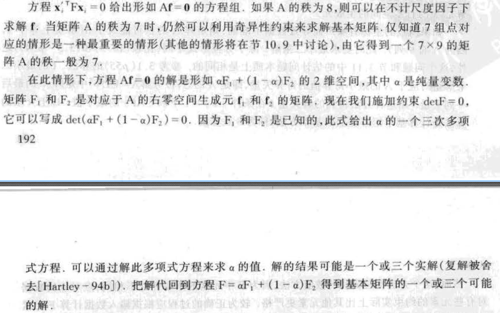

优点：

- 必定生成一个秩 2 的矩阵，无需再像8点法那样强制奇异性约束使得秩为2.

- 对于50%野值的匹配点对集合中，要保证99%的概率得到一个无野值得结果，7点法所需采样点数是8点法的一半。

缺点：

- 它可能给出1个或者3个实数解（复数丢弃），当得到3个解时，还需要对3个解都进行检验（RANSAC？）来选择。

**方法一：**当两个相机内参未知时，至少7个点可求F，当然通常用归一化8点算法。这里用归一化8点法。

参考：《计算机视觉中的多视图几何 第一版》P193

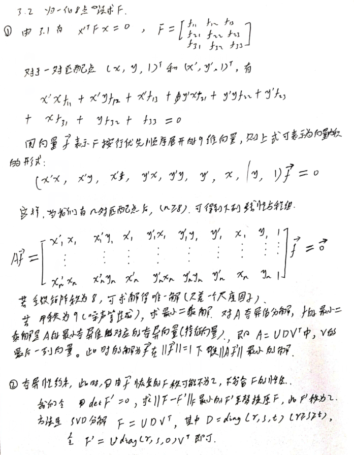

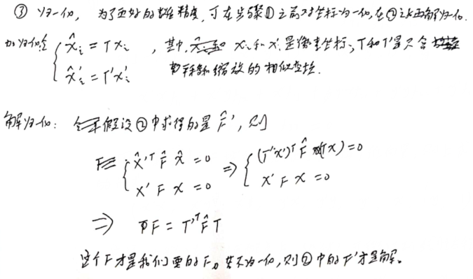


**归一化步骤：**

归一化操作分两步进行，首先对每幅图像中的坐标进行平移（每幅图像的平移不同）使图像中匹配的点组成的点集的形心（Centroid，即x和y各自的平均值）移动到原点；接着对坐标系进行缩放是的点 $p=(x,y,w)^T$ 中的各个分量总体上有一样的平均值，各个坐标轴的缩放相同的，最后选择合适的缩放因子使点p到原点的平均距离是 $\sqrt{2}$ 。 概括起来变换过程如下：

1. 对点进行平移使其形心位于原点。
2. 对点进行缩放，使它们到原点的平均距离为 $\sqrt{2}$
3. 对两幅图像独立进行上述变换


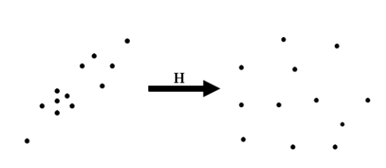

上图左边是原始图像的坐标，右边是归一化后的坐标，H是归一化的变换矩阵，这里用T来表示。

矩阵T的求解：T是如下形式的相似变换矩阵，他的含义是先移动坐标系到原点，再进行缩放
$$
T = 
\left [\begin{matrix}
s & 0 & 0 \\ 
0 & s & 0 \\
0 & 0 & 1
\end{matrix} \right ] 
\left [\begin{matrix}
1 & 0 & -\overline{u} \\ 
0 & 1 & -\overline{v} \\
0 & 0 & 1
\end{matrix} \right ]  = 
 \left [\begin{matrix}
s & 0 & -s\overline{u} \\ 
0 & s & -s\overline{v} \\
0 & 0 & 1
\end{matrix} \right ]
$$
其中，s为缩放尺度，$(\overline{u}, \overline{v})$ 为点集的形心 （就是x和y坐标各自的均值）。对于有N个点的点集合来说，他们的计算如下
$$
\overline{u} = \frac{1}{N}\sum_{i=1}^{N}u_i, \overline{v} = \frac{1}{N}\sum_{i=1}^{N}v_i \\
s = \frac{\sqrt{2}}{\frac{1}{N}\textstyle \sum_{i=1}^{N}\sqrt{(u_i-\overline{u})^2+(v_i-\overline{v})^2}}
$$


**方法二：**当两个相机内参已知时，求解F其实就是求解E即可。

参考：《视觉SLAM十四讲 第一版》P144

E矩阵自由度为5（$[t]_{\times}$和R各有3自由度，又由于E尺度等价性减去一个自由度，所以5个），按理说可以用 `5点法​`  计算E，但是由于E的内在性质是非线性性质，在求解线性方程时会带来麻烦，因此也可以考虑只使用它的尺度等价性约束去求解，这就是经典的 `8点法` 。

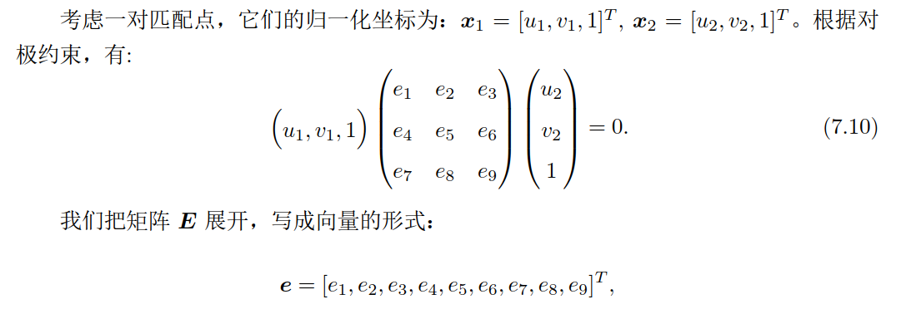


其中，系数矩阵为8x9的，当系数矩阵是行满秩时，令 $e_9=1$ 可求得矩阵E的所有元素。

当点数为多少时，才能求得一个有效的F？

### TODO

- svd分解求最小二乘解，为什么是最后一列矢量？《计算机视觉中的多视图几何》P206

- 接下来用E恢复R和t。

- 这里有个问题，Ax=0，约束||x||=1，正好可以用SVD分解求解它的最小二乘解。那如果不带约束呢？怎么求最小二乘解？

  - Ax=0要么只有0解，要么有无穷多解，而为了求唯一解或者有限个解，所以才加约束||x||=1，加了约束后，Ax=0的所有解，就是对A进行SVD分解后，最小奇异值对应的右奇异向量。而不带约束的问题，其实是非齐次线性方程组Ax=b，对于这种，可以求伪逆，即可求解最小二乘解了。
  
  - 对于Ax=b，$A \in C^{m \times n}_{r}$。SVD求最小二乘解的方法。先用SVD求解A的伪逆，然后再用伪逆求最小二乘解 $x_{LS} = A^+b$
    $$
    A = U\begin{bmatrix}
     \Sigma_r & \mathbf{0} \\
     \mathbf{0} & 0
    \end{bmatrix}_{m \times n}V^T
    $$
    则，伪逆为
    $$
    A^+ = V\begin{bmatrix}
     \Sigma_r^{-1} & \mathbf{0} \\
     \mathbf{0} & 0
    \end{bmatrix}_{n \times m}U^T
    $$
  

## 导航


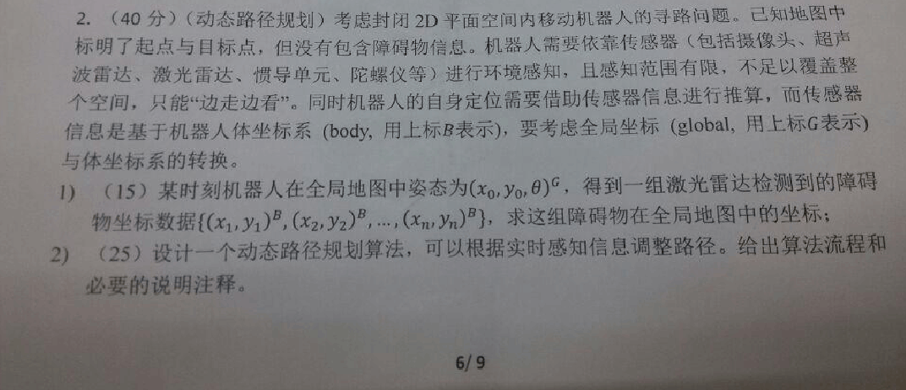


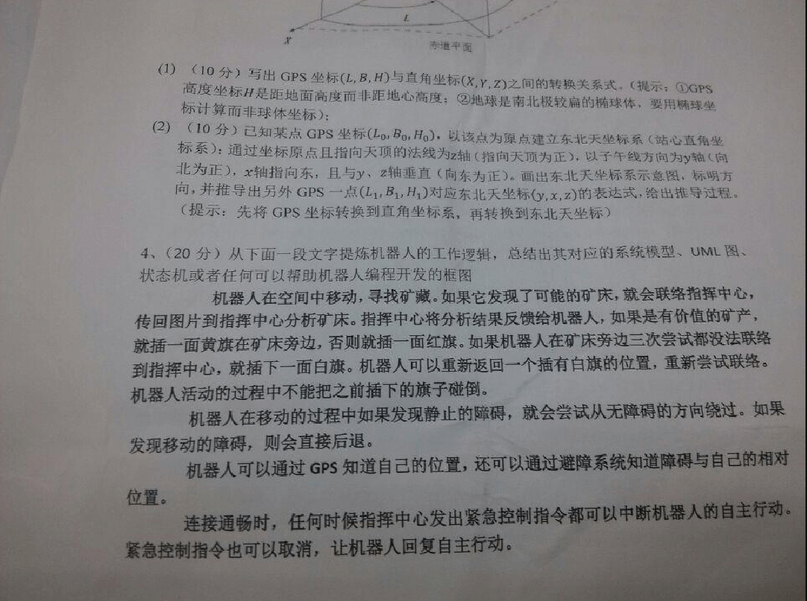

## 控制

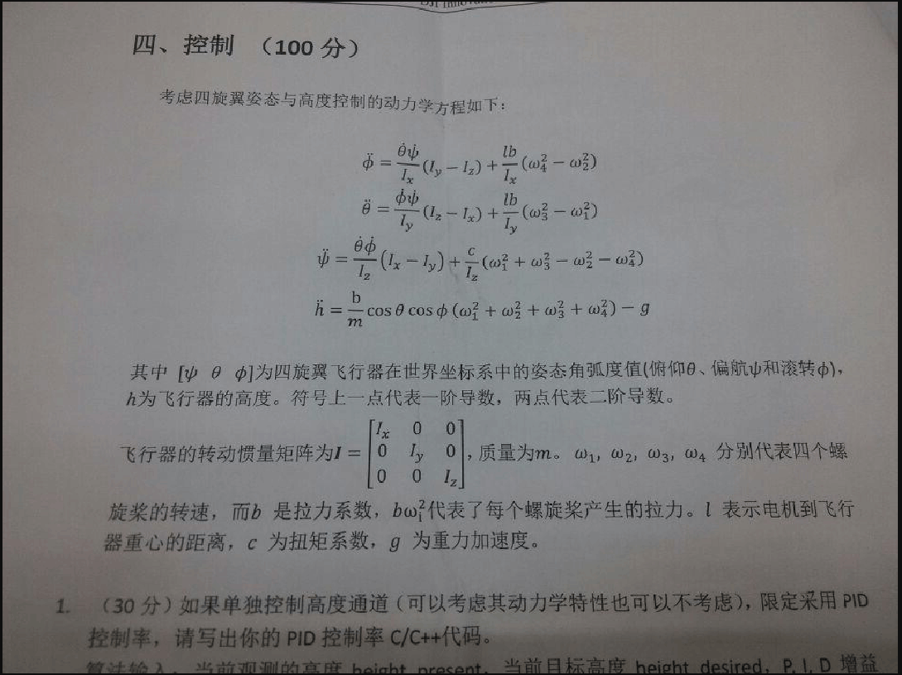

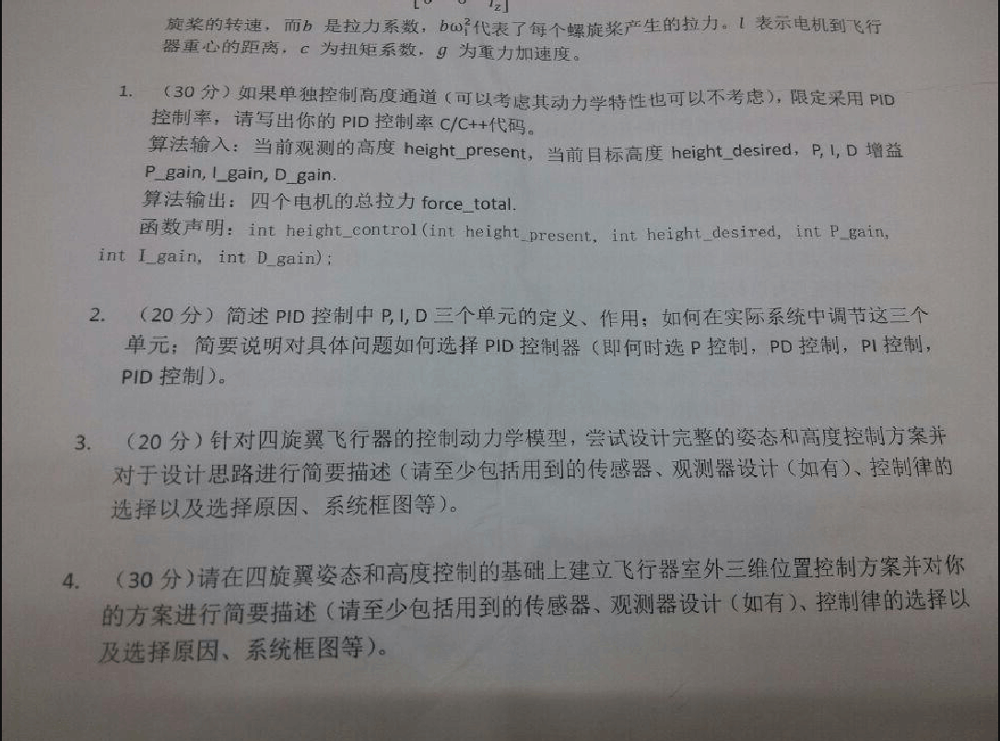


## 通信

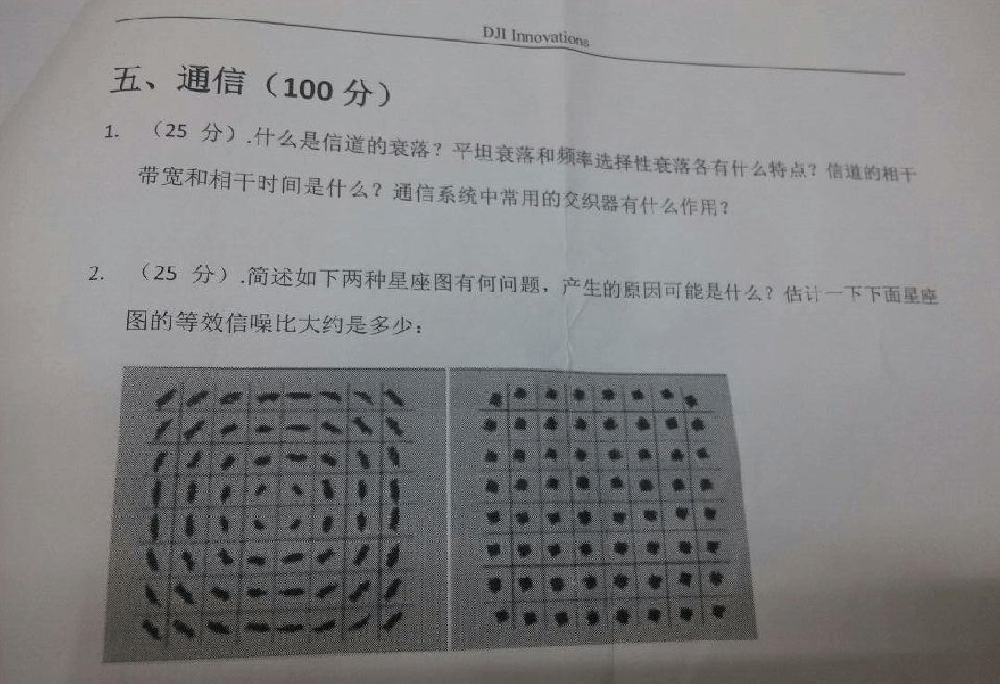

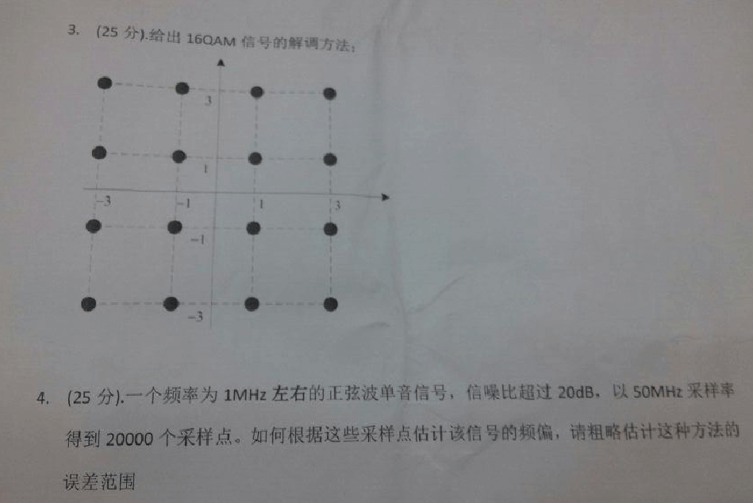