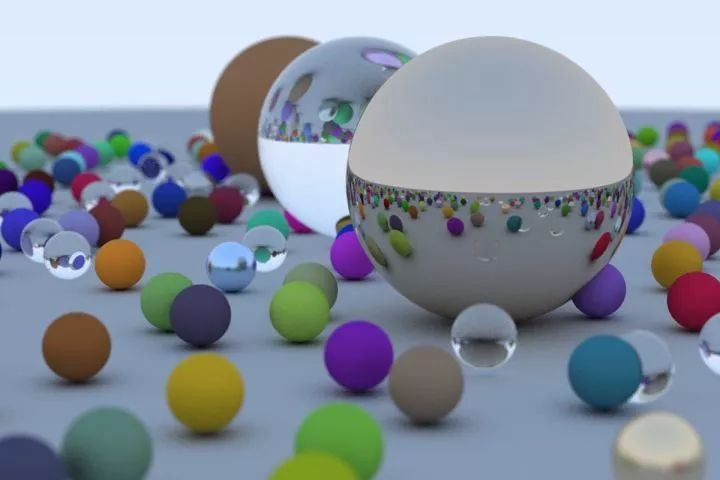
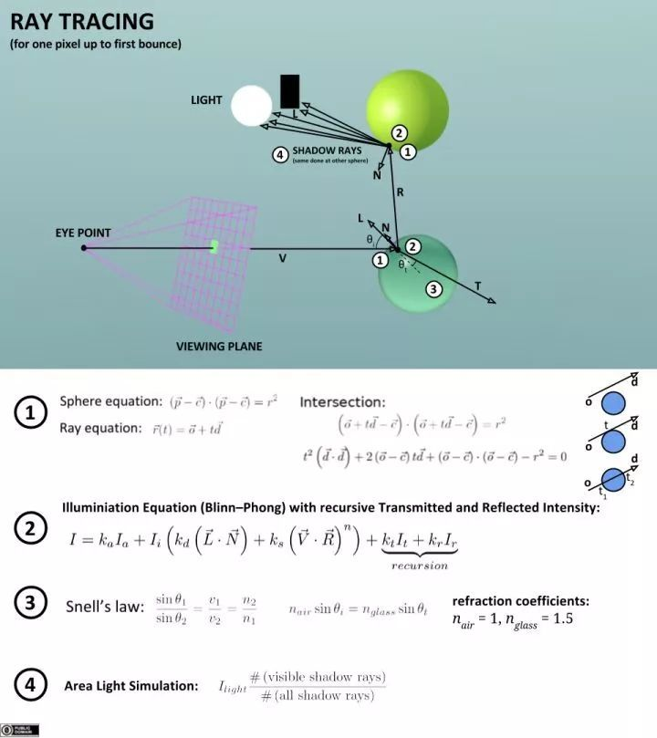
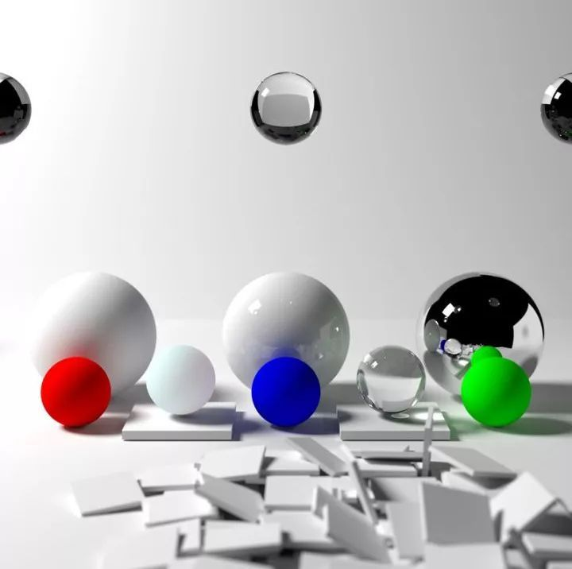

[TOC]

## 基本概念

如果时间充裕，推荐[paper](https://raw.githubusercontent.com/quietshu/-paper-cg-RayTracing/master/RayTracing.pdf)，下载不下来的话，[走这里](https://download.csdn.net/download/baishuo8/10592967)。

基于光线追踪渲染出的效果图

光线追踪（Ray Tracing）算法属于三维图形渲染算法，其基本出发点就是追踪光线，模拟真实的光路和成像过程。

* 相比于其他大部分渲染算法，优势是可以提供更为真实的光影效果
* 劣势是计算量巨大

Ray Tracing Illustration First Bounce

基于对自然界光路的研究，光线追踪采取逆向计算光路来还原真实颜色。模拟，过程中涵盖了光的反射、折射、吸收等特性（精确计算），并辅以其他重要渲染思想（模拟）。其中涉及了以下相关算法：

* 冯氏光照模型（Phong Shading）
* 辐射度（Radiosity）
* 光子映射（Photon Mapping）
* 蒙特卡洛方法（Monto Carlo） 等等

拓展：分布式光线跟踪算法（Distributed Ray Tracing），又称为随机光线追踪（stochasticray tracing）  Cook于1984年引入蒙特卡洛方法（Monte Carlo method）到光线跟踪领域，该方法可以模拟更多的效果，如金属光泽、软阴影、景深（ Depthof Field）、运动模糊等等。

#### 图形学 -- 光栅化(Rasterize/rasteriztion）

什么是光栅化？

我们屏幕上显示的画都是由像素组成的，而三维物体都是点线面构成的。要让点线面，变成能在屏幕上显示的像素，就需要Rasterize这个过程。

如下图，这是一个放大了1200%的屏幕，前面是告诉计算机我有一个圆形，后面就是计算机把圆形转换成可以显示的像素点。这个过程就是光栅化。

相比于光线追踪，**光栅化**最大的特点在于必须要有相机，在光栅化渲染中，要把相机放在待渲染的三角面片前，使用投影矩阵，经过变换以适应屏幕，将其渲染为2D画面上的各个像素。

而光线追踪可以直接执行渲染所需的计算，跟相机无关。这就是光线追踪具有高反射的原因。在光栅化过程中（当然也有其他的trick），我们只有在安装了额外的相机（如镜子）的情况下，才能正确地计算反射。而光线追踪可从任何地方发射光线，所以我们能用光追计算在任意一点上的反射。

#### 路径追踪

什么是路径追踪？

简单来说，路径追踪 = 光线追踪+ 蒙特卡洛方法。

基本思想是从视点发出一条光线，光线与物体表面相交时根据表面的材质属性继续采样一个方向，发出另一条光线，如此迭代，直到光线打到光源上（或逃逸出场景），然后用蒙特卡洛的方法，计算其贡献，作为像素的颜色值。

拓展：双向路径追踪（Bidirectional Path  Tracing）的基本思想是同时从视点、光源打出射线，经过若干次反弹后，将视点子路径（ eye path） 和光源子路径（ light  path）  上的顶点连接起来（连接时需要测试可见性），以快速产生很多路径。这种方法能够产生一些传统路径追踪难以采样到的光路，所以能够很有效地降低噪声。  进一步的， [Veach 1997]将渲染方程改写成对路径积分的形式，允许多种路径采样的方法来求解该积分。

注：(光线投射)Ray Casting ，(光线追踪)Ray Tracing，(路径追踪)Path Tracing的区别

回答：

• Ray Tracing：这其实是个框架，而不是个方法。符合这个框架的都叫raytracing。这个框架就是从视点发射ray，与物体相交就根据规则反射、折射或吸收。遇到光源或者走太远就停住。一般来说运算量不小。

• Ray Casting：其实这个和volumetric可以脱钩。它就是ray tracing的第一步，发射光线，与物体相交。这个可以做的很快，在Doom 1里用它来做遮挡。

• Path Tracing：是ray tracing + 蒙特卡洛法。在相交后会选一个随机方向继续跟踪，并根据BRDF计算颜色。运算量也不小。还有一些小分类，比如Bidirectional path tracing。

## 光线追踪算法前言

1、Forward Tracing

在用计算机生成的图像中模拟光与物体相互作用过程之前，我们需要了解一个物理现象。一束光线照射在物体上时，反射的光子中只有少数会到达我们眼睛的表面。想象一下，假设有一个每次只发射一个光子的光源，光子从光源发出并沿着直线路径行进，直至撞击到物体表面，忽略光子的吸收，该光子会以随机的方向反射。如果光子撞击到我们的眼睛表面，则我们会看到光子被反射的点。具体过程如下图所示。

现在从计算机图形的角度来看待这种情况。首先，我们用像素组成的平面代替我们的眼睛。在这种情况下，发射的光子将撞击图形平面上许多像素的一个，并将该点的亮度增加到大于零的值。重复多次直到所有的像素被调整，创建一个计算机生成的图像。这种技术称为前向光线追踪（Forward Tracing），因为我们是沿着光子从光源向观察者的前进的路径。

但是，这种技术在计算机中模拟光子与物体相互作用是不太现实的，因为在实际中反射的光子击中眼睛表面的可能性是非常非常低的，我们必须投射大量的光子才能找到一个能够引起眼睛注意的。此外，我们也不能保证物体的表面被光子完全覆盖，这是这项技术的主要缺点。

换句话说，我们可能不得不让程序一直运行，直到足够的光子喷射到物体的表面上获得精确的显示。这意味着我们要监视正在呈现的图像以决定何时停止应用程序。这在实际生产环境中是不可能的。另外，正如我们将看到的，射线追踪器中最昂贵的任务是找到射线几何交点。从光源产生大量光子不是问题，但是在场景内找到所有的交点将会是非常昂贵的。
2、Backward Tracing

这项技术为前向光线追踪技术的缺陷提供了一个方便的解决方案。由于我们的模拟不能像自然一样快速完美，所以我们必须妥协，并追踪从眼睛进入到场景中的光线。

光线照到一个物体时，我们可以通过将另一条光线（称为光线或阴影光线）从击中点投射到场景的光线，得到它所接受到的光子数量。这个“光线”有的时候会被另一个物体阻挡，这意味着我们原来的撞击点在阴影中，没有获得任何照明。

## 光线追踪算法实现

#### 1、基本原理

* 光线追踪算法采用由像素组成的图像。对于图像中的每个像素，它将主光线投射到场景中。该主光线的方向是通过追踪从眼睛到像素中心线获得的。一旦我们确定了主射线的方向，我们就开始检查场景中的每个对象，看它是否与其中的任何一个相交。当发生主射线与多个对象相交的情况时，我们选择交点离眼睛最近的物体。
* 然后，我们从交叉点向光线投射阴影射线。如果这条特定的光线在通往光源的路上不与某个物体相交，那么这个点就被照亮了。

* 如果它与另一个物体相交，则该物体在其上投下阴影。

* 最后，如果我们对每个像素重复这一操作，就可以获得三维场景的二维表示。

#### 2、加入反射和折射

在光学中，反射和折射的方向都是基于相交点处的法线和入射光线（主光线）的方向。

为了计算折射方向，我们还需指定材料的折射率。

同样，像玻璃球类的物体同时具有反射性和折射性的事实。我们需要为表面上的给定点计算两者的混合值。反射和折射具体值的混合取决于主光线（或观察方向）和物体的法线和折射率之间的夹角。有一个方程式精确地计算了每个应该如何混合，这个方程被称为菲涅耳方程。

加入反射折射后，进行以下三个步骤：

* 计算反射

为此，我们需要两个项：交点处的法线和主光线的方向。

一旦我们获得了反射方向，我们就朝这个方向发射新的光线。我们假设反射光线撞击了红色球体，通过向光线投射阴影射线来找出到达红色球体上的那个点的光线多少。这会得到一种颜色（如果是阴影，则为黑色），然后乘以光强并返回到玻璃球的表面。

* 计算折射

注意，因为光线穿过玻璃球，所以它被认为是透射光线（光线从球体的一侧传播到另一侧）。为了计算透射方向，我们需要在知道击中点的法线，主射线方向和材料的折射率。

当光线进入并离开玻璃物体时，光线的方向会改变。每当介质发生变化时都会发生折射，而且两种介质具有不同的折射率。折射对光线有轻微弯曲的作用。这个过程就是让物体在透视时或在不同折射率的物体上出现偏移的原因。

现在让我们想象一下，当折射的光线离开玻璃球时，它会碰到一个绿色的球体。在那里，我们再次计算绿色球体和折射射线之间交点处的局部照明（通过拍摄阴影射线）。然后，将颜色（如果被遮挡，则为黑色）乘以光强并返回到玻璃球的表面。

* 应用菲涅尔方程

我们需要玻璃球的折射率，主光线的角度，以及击中点的法线。使用点积，菲涅耳方程返回两个混合值。

这种算法的美妙之处在于它是递归的。迄今为止，在我们研究过的情况下，反射光线照射到一个红色的、不透明的球体上，而折射光线照射到一个绿色的、不透明的和漫射的球体上。但是，我们会想象红色和绿色的球体也是玻璃球。为了找到由反射和折射光线返回的颜色，我们必须按照与原始玻璃球一起使用的红色和绿色球体的相同过程。

这是光线追踪算法的一个严重缺陷。想象一下，我们的相机是在一个只有反射面的盒子里。从理论上讲，光线被困住了，并且会持续不断地从箱子的墙壁反弹（或者直到你停止模拟）。出于这个原因，我们必须设置一个任意的限制值，从而防止光线相互作用导致的无限递归。每当光线反射或折射时，其深度都会增加。当光线深度大于最大递归深度时，我们就停止递归过程。

#### 3、代码和伪代码实现

[链接一](http://www.scratchapixel.com/code.php?id=3&origin=/lessons/3d-basic-rendering/introduction-to-ray-tracing)

[链接二](https://blog.csdn.net/hmbxsy/article/details/80509876)

## 参考资料

[光栅化理解](https://www.jianshu.com/p/9827c27bc41f)

[光线投射 ，光线追踪与路径追踪的区别](https://www.sohu.com/a/228632244_468740)

[视觉SLAM14讲——相机模型介绍](https://zhuanlan.zhihu.com/p/41023782)

