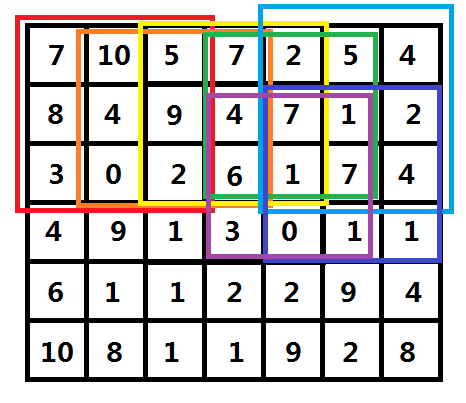

[TOC]

## 中值滤波性质

- 中值是一个比均值更稳健的平均值，因此邻域中一个非常不具有代表性的像素不会对中值产生显著影响。
- 可以保护图像尖锐的边缘。由于中值实际上必须是邻域中一个像素的值，当过滤器跨界时，中值过滤器不会创建新的不现实的像素值。由于这个原因，中值滤波器比平均滤波器在保留锐边方面要好得多。
- 可以有效的消除脉冲噪声，例如椒盐噪声。
- 加权中值滤波能够改进中值滤波的边缘信号，使其良好保持效果.
- 与均值滤波对比。
    - 均值滤波是一种线性平均滤波器，它通过求窗口内所有像素的平均值来得到中心像素点的像素值。这样的好处是可以有效的平滑图像，降低图像的尖锐程度，降低噪声。但缺点是只能减弱但是不能消除噪声。
    - 中值滤波也是一种非线性滤波器，它通过找窗内的所有像素值的中值然后赋给中心像素点，然后得到输出图像，这样做的好处是，它不创造新的像素值，只是取周围像素值作为它的输出，这一方法可以**有效的消除脉冲噪声**，而且可以很好的保护图像尖锐的边缘。

## 中值滤波原理

中值滤波指定一个大小为n*n的窗口，n一般为奇数，窗口滑过原始图像的每个像素，每次滑动都进行一次计算，计算方法是，将窗口内所有像素按像素值排序，选取中位数，作为窗口中心点覆盖的那个像素的灰度值。窗口滑过原始图像的过程如下图：


**滤波效果：**

|                 输入                  |            中值滤波输出             |
| :-----------------------------------: | :---------------------------------: |
|  |  |

### 边界处理

对于有限长的数据，自然会存在两个边界，对于边界的处理有很多种方法，常见的方法有：

- 不处理边界的数据，原样输出。
- 将边界值重复。
- 前后补 0。
- 在边界时缩小窗的大小。

### 优化方法

假设图片宽和高分别为w和h，图像通道数为c（若是RGB图，则c=3），中值滤波窗口大小为n*n。

#### 一般方法

对于窗口内元素找中位数首先需要排序，采用最快的排序方法例如 `快速排序` ，计算次数为 $n^2logn^2$ 。所以采用传统方法的计算时间复杂度大概为：$w \times h \times c \times n^2log_2n^2$ 。

#### 优化方法

参考[夜深人静写算法（三）- 树状数组](https://blog.csdn.net/chaipp0607/article/details/72236892)。

利用树状数组+二分查找+滑动窗口快速查找中位数，可以将复杂度降低到 $w \times h \times c \times log_{2}^{2}n^2$ 。

#### 一维中值滤波问题

对于二维的情况不是很容易下手的话，不妨先从一维的情况进行考虑。

将问题转化成一维，可以描述成：给定**n**(n <= 100000)个范围在[0, 255]的数字序列a[i] (1 <= i < = n)和一个值**r** (2r+1 <= n)，对于所有的a[k] (r+1 <= k <= n-r)，将它变成 a[k-r ... k+r] 中的中位数。

```
a[1...7] = [1 7 6 4 3 2 1]  r = 2
d[3] = median( [1 7 6 4 3] ) = 4
d[4] = median( [7 6 4 3 2] ) = 4
d[5] = median( [6 4 3 2 1] ) = 3
```

所以原数组就会变成a[1..7] = [1 7 4 4 3 2 1]   

那么总共需要计算的元素为n-2r，取这些元素的左右r个元素的值需要2r+1次操作，(n-2r)*(2r+1) 当r = (n-1)/4 时取得最大值，为 (n+1)^2 / 4，再加上排序的时间复杂度，所以最坏情况的时间复杂度为O( n^2 logn )。n的范围不允许这么高复杂度的算法，尝试进行优化。

考虑第i个元素的2r+1区域**a[ i-r ... i+r ]**和第i+1个元素的2r+1区域**a[ i+1-r ... i+1+r ]**，后者比前者少了一个元素a[i-r]，多了一个元素a[i+1+r]，其它元素都是一样的，那么在计算第i+1个元素的情况时如何利用第i个元素的情况就成了问题的关键。

#### 数据结构的设计

我们现在假设有这样一种数据结构，可以支持以下三种操作：

1. **插入(Insert)**，将一个数字插入到该数据结构中；
2. **删除(Delete)**, 将某个数字从该数据结构中删除；
3. **询问(Query)**, 询问该数据结构中存在数字的中位数；

如果这三个操作都能在O( log(n) )或者O(1)的时间内完成，那么这个问题就可以完美解决了。具体做法是：

首先将a[1...2r+1]这些元素都插入到该数据结构中，然后询问中位数替换掉a[r+1]，再删除a[1]，插入a[2r+2]，询问中位数替换掉a[r+2]，以此类推，直到计算完第n-r个元素。所有操作都在O( log(n) ) 时间内完成的话，总的时间复杂度就是O( nlogn )。

我们来看什么样的数据结构可以满足这三条操作都在O( log(n) )的时间内完成，考虑每个数字的范围是[0, 255]，如果我们将这些数字映射到一个线性表中(即 HASH表)，插入和删除操作都可以做到O(1)。

具体的，用一个辅助数组d[256]，插入a[i]执行的是d[ a[i] ] ++，删除a[i]执行的是 d[ a[i] ] --；询问操作是对d数组进行顺序统计，顺序枚举i，找到第一个满足**sum{d[j] | 1 <= j <= i}** >= r+1的 i 就是所求中位数（这里r+1是元素个数的一半+1），这样就得到了一个时间复杂度为O(Kn)的算法，其中K是数字的值域（这里讨论的问题值域是256）。

相比之前的算法，这种方法已经前进了一大步，至少n的指数下降了大于一个数量级，但是也带来了一个问题，如果数字的值域很大，复杂度还是会很大，所以需要更好的算法支持。

#### 树状数组华丽登场

在上面基础上，寻找中位数需要进行累加，直到第i个元素的前缀和sum大于r+1，这个过程的复杂度为 O(N)。既然涉及到前缀和，我们可以用相关算法加速，由于元素可修改，所以需要用树状数组或线段树才能进行加速，因为树状数组相对比较简单，所以用它。用了树状数组后，只是求任意前缀和比较快速（O(logN)），但是我们任然要找到大于r+1的前缀和，所以考虑用二分(O(logN))，所以树状数组复杂度为 O(logN*logN)。

这里引入一种数据结构 - 树状数组 ( Binary Indexed Tree，BIT，二分索引树 )，它只有两种基本操作，并且都是操作线性表的数据的：

   1、**add( i, 1 )**    (1<=i<=n)            对第i个元素的值自增1      O(logn)

   2、**sum( i )**     (1<=i<=n)            统计[1...i]元素值的和       O(logn)

试想一下，如果用HASH来实现这两个函数，那么1的复杂度是O(1)，而2的复杂度就是O(n)了，而树状数组实现的这两个函数可以让两者的复杂度都达到O(logn)，具体的实现先卖个关子，留到第二节着重介绍。

有了这两种操作，我们需要将它们转化成之前设计的数据结构的那三种操作，首先：

1. 插入(Insert)，对应的是 add(i, 1)，时间复杂度O( logn )
2. 删除(Delete), 对应的是 add(i, -1), 时间复杂度O( logn )
3. 询问(Query), 由于sum( i )能够统计[1...i]元素值的和，换言之，它能够得到我们之前插入的数据中小于等于i的数的个数，那么如果能够知道sum(i) >= r + 1的最小的i，那这个i就是所有插入数据的中位数了（因为根据上文的条件，插入的数据时刻保证有2r+1个）。因为sum(i)是关于 i 的递增函数，所以基于单调性我们可以二分枚举i (1 <= i <= n)，得到最小的 i 满足sum(i) >= r + 1，每次的询问复杂度就是 O( logn * logn )。 一个logn是二分枚举的复杂度，另一个logn是sum函数的复杂度。

这样一来，一维的Median Filter模型的整体时间复杂度就降到了O(n * logn * logn)，已经是比较高效的算法了。

接下来就是要来说说树状数组的具体实现了。

#### 树状数组原理和实现

参考：[树状数组（Java 、Python）](https://leetcode-cn.com/problems/count-of-smaller-numbers-after-self/solution/shu-zhuang-shu-zu-by-liweiwei1419/) 的「树状数组」知识入门部分

#### 再说Median Filter

基于二分模型的一维Median Filter问题已经圆满解决了，那么最后让我们回到二维的Median Filter问题上来。


有了一维的基础，对于二维的情况，其实也是一样的，如图三-5-1，图中红色的框为(1, 1)这个像素点的(2r+1)矩形区域，橙色的框则是(1, 2)的，它们的差别其实只是差了两列；同样的，橙色框和黄色框也差了两列，于是，我们可以从左向右枚举，每次将这个矩形框向右推进一格，然后将"离开"框的那一列数据从树状数组中删除，将"进入"框的那一列数据插入到树状数组中，然后统计中位数。

当枚举到右边界时，将矩形框向下推进一格，然后迂回向左，同样按照之前的方案统计中位数，就这样呈蛇字型迂回前进（具体顺序如图所示的红、橙、黄、绿、青、蓝、紫），这样就得到了一个 $O(n^3 \times log_{2}^{2}n)$  的算法，比朴素算法下降了一个数量级。

## 代码实现

完整可执行工程在[这里](../src/ImageProcessing/中值滤波)。

中值滤波一般方法的实现，不带优化：

```cpp
#include <opencv2/core.hpp>
#include <opencv2/highgui.hpp>
#include <iostream>
#include <math.h>


// median filter
cv::Mat median_filter(cv::Mat img, int kernel_size){
  int height = img.rows;
  int width = img.cols;
  int channel = img.channels();

  // prepare output
  cv::Mat out = cv::Mat::zeros(height, width, CV_8UC3);

  // prepare kernel
  int pad = floor(kernel_size / 2);
  
  // filtering
  double v = 0;
  int vs[kernel_size * kernel_size];
  int count = 0;
  
  for (int y = 0; y < height; y++){
    for (int x = 0; x < width; x++){
      for (int c = 0; c < channel; c++){
      v = 0;
      count = 0;
      
      for (int i = 0; i < kernel_size * kernel_size; i++){
        vs[i] = 999;
      }
      
      // get neighbor pixels
      for (int dy = -pad; dy < pad + 1; dy++){
        for (int dx = -pad; dx < pad + 1; dx++){
          if (((y + dy) >= 0) && ((x + dx) >= 0)){
            vs[count++] = (int)img.at<cv::Vec3b>(y + dy, x + dx)[c];
          }
        }
      }

      // get and assign median
      std::sort(vs, vs + (kernel_size * kernel_size));
      out.at<cv::Vec3b>(y, x)[c] = (uchar)vs[int(floor(count / 2)) + 1];
      }
    }
  }
  return out;
}

int main(int argc, const char* argv[]){
  // read image
  cv::Mat img = cv::imread("../imori_noise.jpg", cv::IMREAD_COLOR);

  // median filter
  cv::Mat out = median_filter(img, 3);
  
  //cv::imwrite("out.jpg", out);
  cv::imshow("answer", out);
  cv::waitKey(0);
  cv::destroyAllWindows();

  return 0;
}
```


## 参考资料

- [图像处理一百问 |中值滤波部分](https://github.com/gzr2017/ImageProcessing100Wen/)
- [夜深人静写算法（三）- 树状数组](https://blog.csdn.net/chaipp0607/article/details/72236892) | 利用树状数组+二分查找+滑动窗口快速查找中位数
- [均值滤波vs中值滤波](https://blog.csdn.net/u013199483/article/details/69665065)

- [中值滤波器（Median filter）特性及其实现](https://blog.csdn.net/liyuanbhu/article/details/48502005)